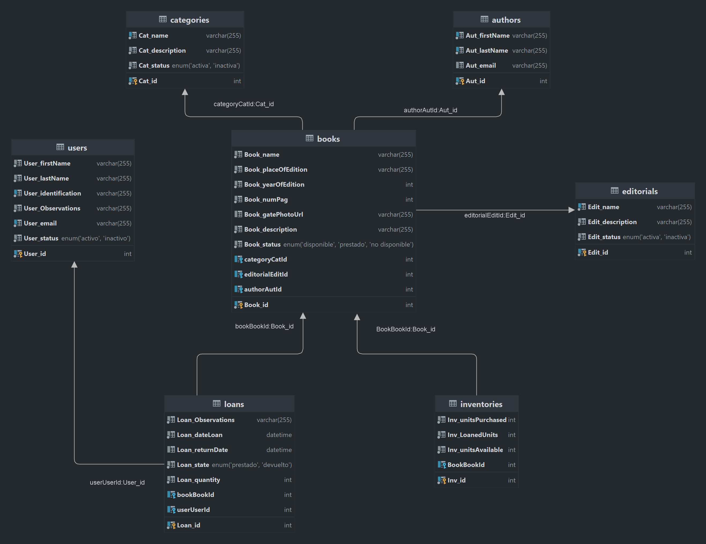

  

# Prueba técnica realizada con NestJS.

## Descripción de la prueba y las tecnologías utilizadas

* Esta prueba técnica consiste en crear un CRUD de usuarios, con sus respectivas validaciones para el control de libros
  prestados y devueltos. Para ello se ha utilizado NestJS, un framework de NodeJS que permite crear aplicaciones escalables,
  robustas y de alto rendimiento. Este framework se basa en el patrón de diseño MVC (Modelo, Vista, Controlador) y en el
  patrón de diseño de software Singleton, que permite crear una única instancia de una clase, y así poder acceder a ella
  desde cualquier parte de la aplicación. Además, NestJS utiliza TypeScript, un lenguaje de programación que permite
  tipar las variables, lo que permite tener un código más robusto y fácil de mantener. En cuanto al frontend se utiliza React
 y NextJs. La parte del frontend no logre terminarla, pero a pesar de esto el backend esta bien construido.

* Se puede acceder a la documentación de NestJS en el siguiente enlace: https://docs.nestjs.com/

* A continuación se muestra el modelo de datos que se ha utilizado para la creación de la base de datos:

* Para la creación de la base de datos se ha utilizado MySQL, un sistema de gestión de bases de datos relacional, que
  permite crear, modificar y administrar bases de datos. Además, se ha utilizado el ORM TypeORM, que permite crear
  entidades y mapearlas a la base de datos, de forma que se pueda acceder a ellas desde la aplicación. También se ha
  usado Swagger, que permite crear documentación de la API de forma automática, a partir de los controladores y
  servicios creados. Adicionalmente, se ha utilizado Docker, que permite crear contenedores de forma sencilla, y así
  desplegar la aplicación en cualquier entorno y por último, se ha utilizado Postman, que permite realizar peticiones
  HTTP de forma sencilla, y así poder probar la API. Para la creación de las entidades se ha utilizado el comando:

## Pasos para la ejecución de la aplicación del lado del servidor

* Para la ejecución de la aplicación del lado del servidor se debe seguir los siguientes pasos:
1. Clonar el repositorio de GitHub en el directorio deseado.
2. Abrir una terminal en el directorio donde se ha clonado el repositorio.
3. Ejecutar el comando `yarn install` para instalar las dependencias del proyecto.
4. Ejecutar el comando ` docker-compose -f docker-compose.yaml --env-file .env up --build -d` para crear el contenedor
    * En caso de que no se tenga instalado Docker, se puede descargar desde el siguiente enlace: https://www.docker.com/products/docker-desktop
      y seguir las instrucciones de instalación.
    * Se debe tener en cuenta que el puerto 8080 debe estar libre para que el contenedor se pueda ejecutar correctamente,
      si no es así, se debe cambiar el puerto en el fichero `docker-compose.yaml` y en el fichero `.env`.
    * También si así se desea, se puede cambiar el nombre de la base de datos en el fichero `.env`.
5. Ejecutar el comando `yarn start:dev` para ejecutar la aplicación del lado del servidor.
   Tenga en cuenta que la aplicación se ejecutará en el puerto 3004, por lo que si este puerto está ocupado, se debe
   cambiar en el fichero `main.ts` y en el fichero `.env`.
6. Abrir el navegador y acceder a la dirección `http://localhost:3004/api` para acceder a la documentación de la API
   o a través de postman.

## Pasos para la ejecución de la aplicación del lado del cliente

1. Abrir una terminal en el directorio donde se ha clonado el repositorio.
2. Ejecutar el comando `npm i` para instalar las dependencias del proyecto.
3. Ejecutar el comando `npm run dev` para ejecutar la aplicación del lado del cliente.
   Tenga en cuenta que la aplicación se ejecutará en el puerto 3000, por lo que si este puerto está ocupado, se debe
   cambiar en el fichero `next.config.js`.